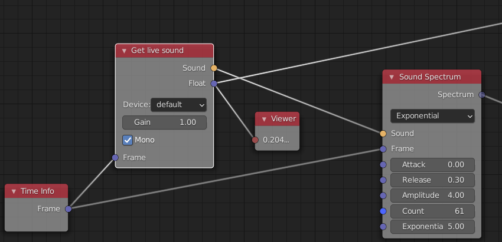

# LiveSoundInput
This is a simple node to capture live audio and feed it into the [animation nodes](https://github.com/JacquesLucke/animation_nodes "animation nodes project on github") in blender.



## Installation
Just put the file in /path/to/addons/animation_nodes/nodes/sound/.
You need to install the python library [sounddevice](https://github.com/spatialaudio/python-sounddevice/ "sounddevice library on github").
This should be done with the version of python shipped with blender (which may differ from your main python installation):
```
/path/to/blender/python/bin/python -m pip install sounddevice
```

## Misc

* You can create several of them, with either the same device source or not.
* A recording stream is open as soon as the node is created, and closed when the node is deleted.
* The float wavepoint output is filtered before being downsampled from the 44,1 kHz buffers to the node tree execution framerate.
* The output Sound is aligned to the current frame, possibly resulting in small erratic latencies (not measured). Currently I see no reason to put efforts in fixing that considering the satisfying results.
* The output audio is mono (average of all channels).

This was tested with animation nodes v2.1.4 and v2.2.2, on linux and windows.
Released under GPLv3.0.
